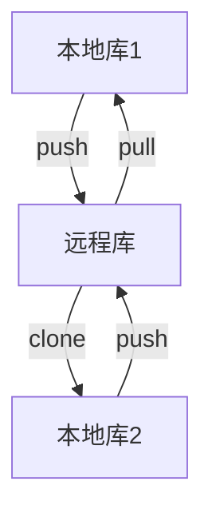
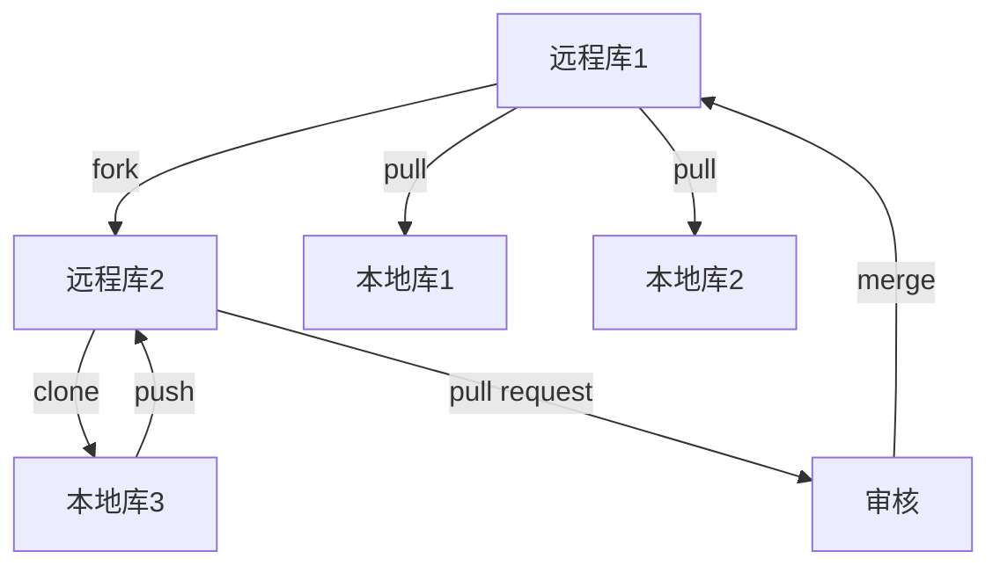

# 本地库和远程库

* 团队内部协作

```mermaid
graph TB
	本地库1 --push--> 远程库
 	远程库 --clone--> 本地库2
 	本地库2 --push--> 远程库
 	远程库 --pull--> 本地库1
```

* 跨团队协作

```mermaid
graph TB
远程库1 --fork-->远程库2
远程库2 --clone-->本地库3
本地库3 --push--> 远程库2
远程库2 --pull request--> 审核
审核 --merge--> 远程库1
远程库1 --pull--> 本地库1
远程库1 --pull--> 本地库2
```

